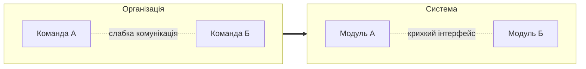
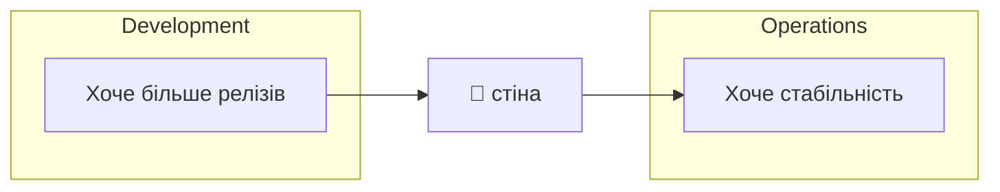
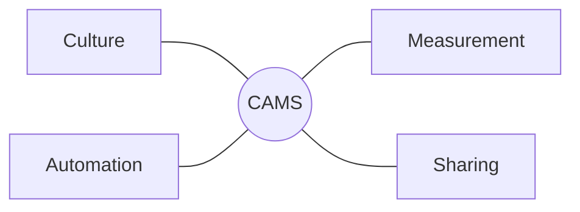
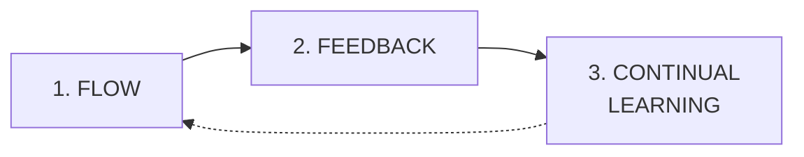
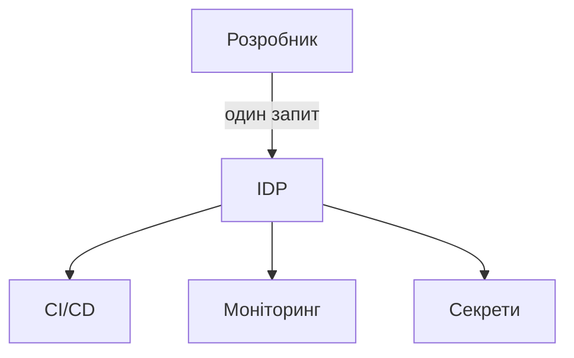
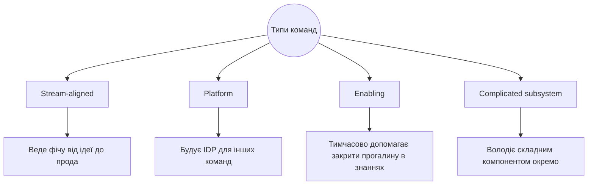
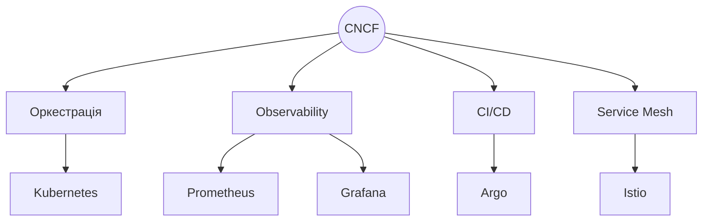
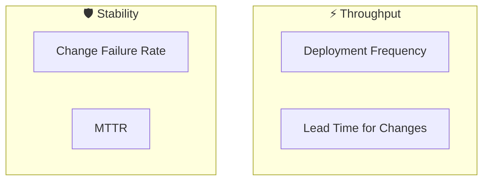
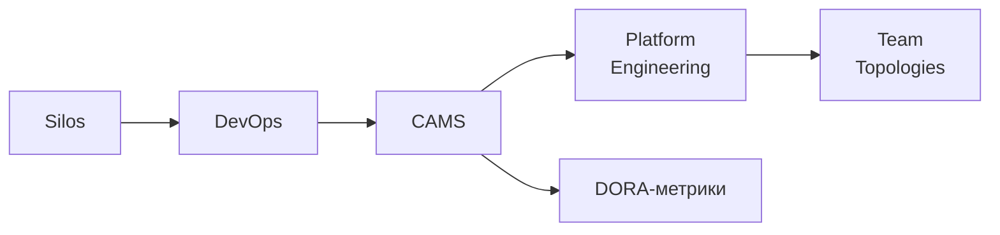

# DevOps: культура, а не набір інструментів

<small>DevOps інфраструктура та хмарні технології · Лекція 1</small>

Note: Вступна лекція. Мета — не завантажити студентів термінами, а показати, яку проблему вирішує DevOps і чому вона взагалі виникла.

---

## План заняття

1. Звідки з'явився DevOps
2. Що таке DevOps і з чого він складається
3. Як масштабувати культуру: Platform Engineering
4. Як виміряти результат: DORA-метрики

---

<!-- .slide: data-background-color="#eef2ff" -->

# Частина 1

## Звідки з'явився DevOps

---

## Трохи історії

--

### До 2009 року

- Agile (2001) прискорив **розробку**: короткі ітерації, зворотний зв'язок
- Але код усе одно "перекидався через стіну" в Operations
- Чим частіше Dev випускає зміни — тим більше інцидентів у Ops
<!-- .element: class="fragment" -->

--

### Velocity Conference, 2009

**John Allspaw & Paul Hammond, Flickr**

Доповідь *"10+ Deploys Per Day"*

Показали, що Dev і Ops можуть працювати як одна команда й деплоїти десятки разів на день без хаосу

--

### DevOpsDays Ghent, 2009

**Patrick Debois**

Перша конференція під назвою DevOps

Звідси й пішов сам термін

---

## Закон Конвея

<!-- .slide: data-background-color="#f4f1ea" -->

> Структура системи, яку створює організація, повторює структуру комунікації всередині цієї організації

--

### Наочно

Розділені команди будують розділену систему

---

## Проблема Silos

--

### Знайомий діалог

- Dev: *"У мене на машині працювало"*
- Ops: *"Ви нам зламали прод"*

Обидва праві зі свого боку стіни — проблема не в людях, а в самій стіні

--

### Silos — не лише між Dev і Ops

- Security часто теж окремий "силос" — приходить в кінці з переліком зауважень
- **DevSecOps** — та сама ідея CAMS, але з безпекою всередині процесу, а не після нього
- Принцип **"Shift Left"**: перевірки безпеки й якості максимально рано — на етапі коду, а не перед релізом
<!-- .element: class="fragment" -->

---

## Що таке DevOps

<!-- .slide: data-background-color="#f4f1ea" -->

> Культура й сукупність практик, що об'єднують розробку та експлуатацію ПЗ в єдиний процес — щоб скоротити час від ідеї до продакшну, не жертвуючи надійністю

---

## Головна теза курсу

<h2 style="color:#b45309">Інструменти автоматизують практики, але не створюють культуру</h2>

Kubernetes-кластер сам по собі нікого DevOps-інженером не робить

---

<!-- .slide: data-background-color="#eef2ff" -->

# Частина 2

## З чого складається DevOps

---

## CAMS: чотири опори

--

### C — Culture

- Спільна відповідальність за продукт від коду до прода
- **Blameless postmortem** — розбір без пошуку винного
- Довіра замість бюрократичного контролю
<!-- .element: class="fragment" -->

--

### A — Automation

- Автоматизуємо все, що можна без втрати якості
- Мета — прибрати джерело помилок, а не людей
- Класичний приклад — конвеєр CI/CD
<!-- .element: class="fragment" -->

--

### Приклад: CI/CD пайплайн

Кожен крок — це те, що раніше робила людина руками й що тепер робить автоматика

--

### CI vs CD vs Continuous Deployment

<b>CI</b> Continuous Integration код регулярно зливається в main і проходить автотести

<b>CD</b> Continuous Delivery код завжди готовий до релізу, деплой — за кнопкою

<b>CD</b> Continuous Deployment кожна зміна, що пройшла тести, автоматично йде в прод

Це три різні рівні зрілості одного й того самого конвеєра, а не синоніми

--

### Ще один приклад: Infrastructure as Code

- Інфраструктура описується кодом (Terraform, Ansible, Helm), а не клікається руками в консолі хмари
- **Immutable infrastructure**: замість "полагодити сервер" — викотити новий і викинути старий
- Наслідок: середовище завжди відтворюване й версійоване, як звичайний код
<!-- .element: class="fragment" -->

--

### M — Measurement

- Що не вимірюється — не покращується
- Метрики процесу і метрики системи
- Сюди прямо ведуть **DORA-метрики** — розберемо детально в Частині 4
<!-- .element: class="fragment" -->

--

### Приклад: Observability vs Monitoring

- **Monitoring** відповідає на відоме питання: "чи працює сервіс?" (заздалегідь визначені дашборди)
- **Observability** дозволяє поставити питання, якого ви заздалегідь не передбачили
- Три опори observability: **логи, метрики, трейси**
<!-- .element: class="fragment" -->

--

### S — Sharing

- Runbook'и й документація, зрозумілі всім
- Спільні дашборди
- Знижуємо **bus factor**
<!-- .element: class="fragment" -->

---

## Коріння в Lean: Toyota Production System

- DevOps багато запозичив у виробничої системи Toyota, а не винайшов усе з нуля
- **Muda** — усунення втрат (зайве очікування, зайва робота, дефекти)
- **Kanban** і обмеження **work-in-progress**: краще менше задач одночасно, ніж багато недоробленого
- **Andon cord**: будь-який робітник міг зупинити конвеєр, побачивши дефект — якість важливіша за темп
<!-- .element: class="fragment" -->

---

## Three Ways (Gene Kim, *The Phoenix Project*)

Ці ж принципи Toyota, переформульовані для інженерії ПЗ

--

### Що це означає

- **Flow** — прибрати все, що блокує рух зміни до клієнта (аналог конвеєра без зупинок)
- **Feedback** — Dev швидко бачить наслідки своєї зміни в проді (аналог Andon cord)
- **Learning** — експерименти й аналіз збоїв як норма, а не покарання (аналог Kaizen — постійного вдосконалення)
<!-- .element: class="fragment" -->

---

## "You build it, you run it"

<small>Модель володіння, яку впровадив Amazon</small>

--

### Старий підхід

Dev пише → Ops запускає

Dev не бачить наслідків власних рішень

--

### DevOps-підхід

Хто написав сервіс — той і чергує

Погане архітектурне рішення будить розробника вночі

---

<!-- .slide: data-background-color="#eef2ff" -->

# Частина 3

## Як масштабувати культуру

---

## Коли команд стає багато

- Мікросервіси, кілька хмар, десятки CI/CD пайплайнів
- Від розробника очікують: логіку + Kubernetes + observability + IAM
- Це **когнітивне навантаження (cognitive load)**
<!-- .element: class="fragment" -->

<h3 style="color:#b45309">Рішення — не ще один DevOps-інженер, а платформа</h3>

---

## Platform Engineering

> Команда будує внутрішню платформу, яка робить правильний шлях — найлегшим шляхом (**golden path**)

--

### Internal Developer Platform

--

### Golden Path — не примус

Платформу не нав'язують — її роблять настільки зручною, що обхідні шляхи стають невигідними

Platform Engineering = Automation + Sharing, доведені до рівня продукту

---

## Team Topologies

<small>Модель організації команд навколо потоку цінності (Matthew Skelton, Manuel Pais)</small>

--

### Навіщо це знати

Platform-команда з попереднього слайду — це не "ще один Ops", а окремий тип команди в цій моделі, зі своїм продуктом (платформою) і своїми користувачами (іншими розробниками)

---

## DevOps і SRE

| | DevOps | SRE |
|---|---|---|
| Що це | Культура й принципи | Конкретна практика (Google) |
| Фокус | Прибрати Silos | SLI / SLO / error budget |

<small>SRE — один зі способів реалізувати принципи DevOps на практиці</small>

---

## CNCF: екосистема, а не список назв

--

### Навіщо це знати

Порядок тем курсу — рух по цій карті: контейнер → оркестрація → платформа

---

<!-- .slide: data-background-color="#eef2ff" -->

# Частина 4

## Як виміряти результат: DORA-метрики

---

## Відкрите питання

Буква **M** у CAMS лишає питання:

<h3 style="color:#b45309">як виміряти, що DevOps-практики працюють?</h3>

---

## Хто такі DORA

- **DevOps Research and Assessment** — дослідницька програма, що з 2014 року щорічно опитує інженерні команди
- Книга-першоджерело — **Accelerate** (Nicole Forsgren, Jez Humble, Gene Kim)
- Понад 39 000 респондентів за роки досліджень; сьогодні програма — частина Google Cloud
- Результат — **State of DevOps Report**, найцитованіше галузеве дослідження ефективності delivery
<!-- .element: class="fragment" -->

---

## DORA: Four Keys

--

### Deployment Frequency

**Що це:** як часто команда успішно випускає зміни в прод

**Джерело даних:** CI/CD-система (не плутати "merge в main" з реальним деплоєм)

| Elite | High | Low |
|---|---|---|
| on demand (кілька разів на день) | раз на тиждень — раз на місяць | раз на 1–6 місяців |

--

### Lead Time for Changes

**Що це:** час від коміту до роботи в продакшні

**Джерело даних:** git timestamp коміту + лог деплою

| Elite | Low |
|---|---|
| години — менше доби | від тижня до кількох місяців |

--

### Change Failure Rate

**Що це:** відсоток релізів, що спричиняють інцидент або відкат

**Джерело даних:** incident management / тікет-система, зіставлена з деплой-логом

| Elite | Low |
|---|---|
| приблизно 5–15% | 46–60% |

--

### MTTR (Failed Deployment Recovery Time)

**Що це:** скільки часу потрібно, щоб відновити сервіс після невдалого деплою

**Джерело даних:** incident management (час відкриття → час закриття інциденту)

| Elite | Low |
|---|---|
| менше години | від тижня до місяця |

<small>За даними DORA State of DevOps Report 2024</small>

---

## Throughput vs Stability

- Перша пара метрик показує, наскільки прибрали Silos і ручну роботу (Automation + Culture)
- Друга пара показує, наскільки надійно система переносить зміни
- У найкращих команд обидві пари одночасно високі — це не два різні шляхи розвитку, а один
<!-- .element: class="fragment" -->

---

## Що насправді стоїть за метриками

DORA також дослідила **24 інженерні практики**, що статистично зумовлюють хороші показники. Найважливіші з них:

- Trunk-based development — короткоживучі гілки замість тижневих feature-branch
- Автоматизоване тестування й автоматизований деплой
- Слабко зв'язана (loosely coupled) архітектура — команди деплояться незалежно одна від одної
- Робота малими партіями (small batch size)
<!-- .element: class="fragment" -->

<small>Метрики — наслідок; ці практики — причина. Змінювати варто практики, а не "підганяти цифри"</small>

---

## Типові помилки при впровадженні

- Рахувати **merge в main** як деплой — це різні речі
- Прив'язувати DORA-метрики до **індивідуальної премії** розробника — метрики про систему, не про людину
- Оптимізувати одну метрику ізольовано (наприклад, гнати Deployment Frequency, ігноруючи Change Failure Rate)
<!-- .element: class="fragment" -->

---

## Контрінтуїтивний висновок

За даними **DORA State of DevOps Report 2024**, elite-команди деплоять у **182 рази частіше** й мають lead time у **127 разів коротший**, ніж low-performers — і при цьому не жертвують стабільністю

<h3 style="color:#b45309">Швидкість і стабільність — не компроміс</h3>

Правильна автоматизація й культура прибирають саме ті ручні кроки, які є джерелом і повільності, і помилок

---

## Що ми сьогодні зв'язали

---

## Питання для закріплення

1. Чому Silos не вирішити суто технічними засобами?
2. Чим Continuous Delivery відрізняється від Continuous Deployment?
3. Який елемент CAMS реалізує IDP?
4. Чому Deployment Frequency і Change Failure Rate ростуть разом, а не навпаки?
5. Чому небезпечно прив'язувати DORA-метрики до премії конкретного розробника?

---

# Дякую за увагу
