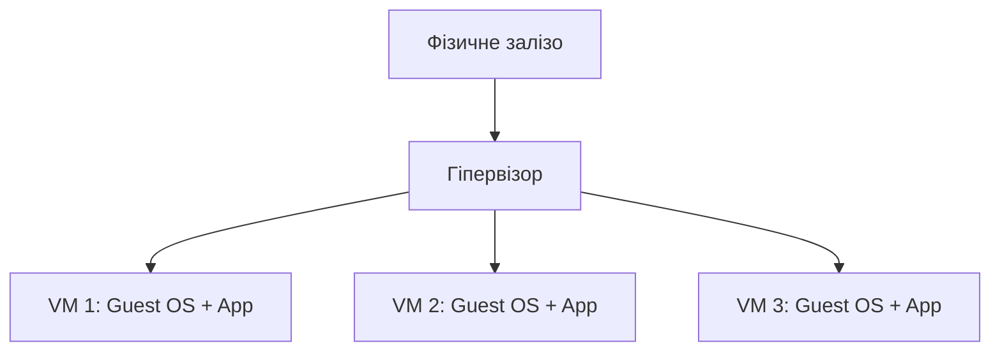
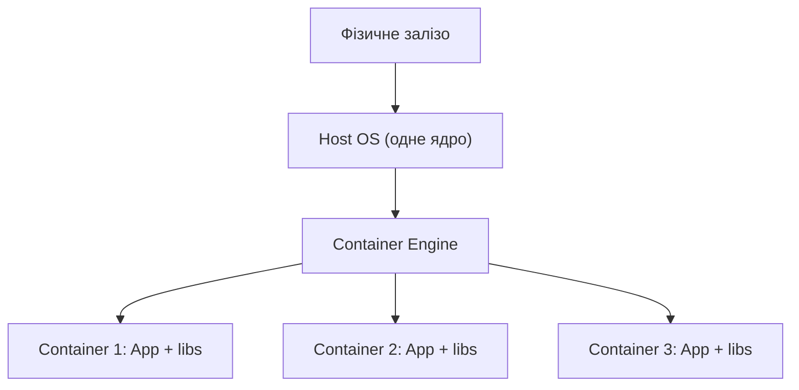
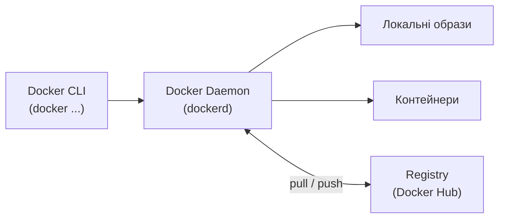
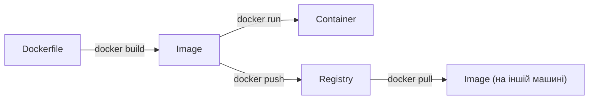
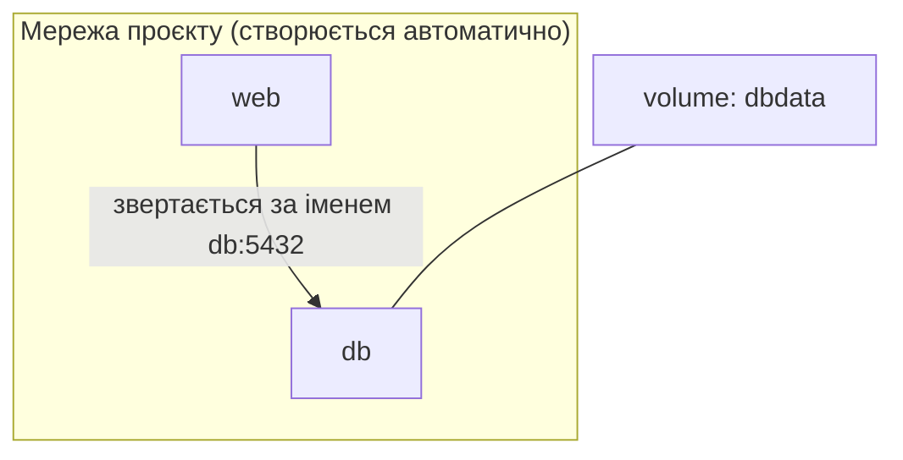
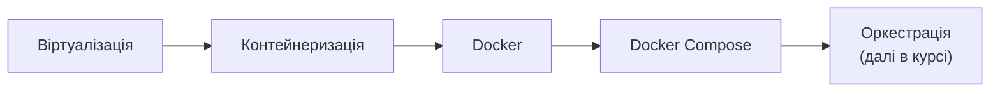

# Docker та Docker Compose

<small>Технології DevOps</small>

<style>
.reveal h1 { font-size: 1.7em; }
.reveal h2 { font-size: 1.2em; }
.reveal h3 { font-size: 0.95em; }
.reveal p, .reveal li { font-size: 0.62em; line-height: 1.4; }
.reveal blockquote { font-size: 0.7em; }
.reveal table { font-size: 0.58em; }
.reveal small { font-size: 0.5em; }
.reveal pre, .reveal code { font-size: 0.48em; }
.reveal ol, .reveal ul { display: inline-block; text-align: left; }

.reveal .mermaid,
.reveal .mermaid svg {
  width: 100% !important;
  height: auto !important;
  max-width: 1000px;
  max-height: 600px;
}
.reveal .mermaid { display: flex; justify-content: center; }
.reveal .mermaid .nodeLabel,
.reveal .mermaid text,
.reveal .mermaid tspan,
.reveal .mermaid .edgeLabel,
.reveal .mermaid .mindmap-node text {
  fill: #1e293b !important;
  color: #1e293b !important;
}
.reveal .mermaid .node rect,
.reveal .mermaid .node polygon,
.reveal .mermaid .node circle {
  fill: #f4f1ea !important;
  stroke: #1e293b !important;
}

.card-row { display: flex; gap: 1.2rem; justify-content: center; margin-top: 1rem; }
.card { background: #f4f1ea; border-radius: 12px; padding: 0.8rem 1.2rem; font-size: 0.6em; text-align: left; }
.card b { font-size: 1.1em; }

.layer-stack { display: flex; flex-direction: column-reverse; gap: 6px; align-items: center; margin-top: 1rem; }
.layer { background: #f4f1ea; border: 1px solid #1e293b; border-radius: 8px; padding: 0.5rem 2rem; font-size: 0.55em; width: 60%; text-align: center; }
.layer.base { background: #e2e8f0; font-weight: bold; }
</style>

Note: Ця лекція — практична основа для роботи з Docker. Мета: студенти повинні розуміти не лише команди, а й що насправді відбувається під капотом, коли вони пишуть docker run.

---

## План заняття

1. Віртуалізація vs контейнеризація
2. Основи Docker
3. Docker Compose

---

## Нагадаємо: з чого ми прийшли

- Минулого разу говорили про **CAMS** — Culture, Automation, Measurement, Sharing
- Проблема **Silos**: "у мене на машині працювало" проти "ви нам зламали прод"
- Буква **A (Automation)** лишилась тоді на рівні ідеї — прибрати ручну роботу, не сказавши **чим саме**
<!-- .element: class="fragment" -->

--

### Чому саме контейнеризація — наступний крок

- "У мене на машині працювало" — це буквально проблема **різних середовищ**, не різних людей
- Контейнер — це і є технічний спосіб зробити середовище розробника, CI-сервера й продакшну **однаковим**
- Це не нова тема — це перше конкретне **"як"** до вчорашнього "що" й "навіщо"
<!-- .element: class="fragment" -->

<small>У карті CNCF з минулої лекції порядок тем невипадковий: контейнер → оркестрація → платформа. Сьогодні — перший крок цієї карти</small>

---

<!-- .slide: data-background-color="#eef2ff" -->

# Частина 1

## Віртуалізація vs контейнеризація

---

## Проблема ізоляції

- Кілька застосунків на одному сервері конфліктують за версіями бібліотек, портами, залежностями
- Хочеться, щоб кожен застосунок жив у своєму ізольованому середовищі
- Є два принципово різні шляхи це зробити: **віртуалізація** і **контейнеризація**
<!-- .element: class="fragment" -->

---

## Віртуалізація

--

### Як це працює



Кожна віртуальна машина містить **повноцінну гостьову ОС** зі своїм ядром

--

### Type 1 vs Type 2 гіпервізор

<div class="card-row">
<div class="card"><b>Type 1 (bare-metal)</b><br>працює прямо на залізі<br>VMware ESXi, KVM, Hyper-V</div>
<div class="card"><b>Type 2 (hosted)</b><br>працює як застосунок поверх ОС<br>VirtualBox, VMware Workstation</div>
</div>

---

## Контейнеризація

--

### Як це працює



Контейнери **діляться ядром хост-ОС** — усередині немає окремої гостьової ОС, лише застосунок і його залежності

--

### Що технічно ізолює контейнер

- **Namespaces** — що процес *бачить*: свій PID, свою мережу, свою файлову систему
- **cgroups** — скільки процес *може використати*: ліміти CPU, пам'яті, I/O
- Docker не винайшов ізоляцію — він красиво запакував уже наявні можливості ядра Linux
<!-- .element: class="fragment" -->

Note: Ізоляція процесів у Linux має довгу історію задовго до Docker: chroot з'явився ще в Unix V7 (1979), FreeBSD Jails — у 2000-х, Linux LXC — у 2008-му. А cgroups спершу називались "process containers" і були розроблені інженерами Google у 2006 році для управління ресурсами на їхніх серверах, лише пізніше потрапивши в основне ядро Linux. Docker з'явився в 2013-му й не додав нової технології ізоляції — його інновація була в UX: зручний CLI, формат образів і Docker Hub для їх поширення.

---

## VM vs Container

| | Віртуальна машина | Контейнер |
|---|---|---|
| Що всередині | Повна гостьова ОС | Лише застосунок + залежності |
| Розмір | Гігабайти | Мегабайти |
| Старт | Хвилини | Секунди / мілісекунди |
| Ізоляція | Максимальна (окреме ядро) | Слабша (спільне ядро хоста) |
| Портативність | Обмежена форматом гіпервізора | Однаковий образ скрізь |

---

## Коли що обирати

<div class="card-row">
<div class="card"><b>Віртуалізація</b><br>потрібні різні ОС на одному залізі<br>сувора multi-tenant ізоляція<br>legacy-застосунки</div>
<div class="card"><b>Контейнеризація</b><br>мікросервіси<br>швидкий CI/CD<br>однакове середовище dev → prod</div>
</div>

<small>На практиці це не "або-або" — контейнери часто запускають усередині віртуальних машин у хмарі</small>

---

<!-- .slide: data-background-color="#eef2ff" -->

# Частина 2

## Основи Docker

---

## Що таке Docker

> Платформа, що пакує застосунок разом з усіма його залежностями в переносний, ізольований образ, який однаково запускається будь-де

Note: Docker представив Соломон Хайкс на конференції PyCon 2013 — як open-source версію внутрішнього інструменту компанії dotCloud, де він працював. Реакція індустрії була настільки бурхливою, що dotCloud за рік повністю перепрофілювалась у Docker Inc. і закрила свій початковий бізнес.

---

## Архітектура Docker



CLI лише надсилає команди демону — саме демон керує образами, контейнерами й мережею

---

## Образ vs Контейнер

<div class="card-row">
<div class="card"><b>Image (образ)</b><br>незмінний шаблон<br>аналог класу в ООП</div>
<div class="card"><b>Container (контейнер)</b><br>працюючий екземпляр образу<br>аналог об'єкта класу</div>
</div>

З одного образу можна запустити скільки завгодно незалежних контейнерів

---

## Шари образу

<div class="layer-stack">
<div class="layer base">FROM ubuntu:22.04</div>
<div class="layer">RUN apt install python3</div>
<div class="layer">COPY app.py /app</div>
<div class="layer">CMD python3 app.py</div>
</div>

Кожна інструкція Dockerfile створює новий незмінний шар; однакові шари кешуються й перевикористовуються між образами

---

## Dockerfile: базовий приклад

```dockerfile
FROM python:3.12-slim
WORKDIR /app
COPY requirements.txt .
RUN pip install -r requirements.txt
COPY . .
EXPOSE 8000
CMD ["python", "app.py"]
```

--

### Чому порядок інструкцій важливий

`COPY requirements.txt` йде **до** `COPY . .` навмисно — якщо змінюється лише код, а не залежності, Docker перевикористає закешований шар з `pip install` і збірка буде набагато швидшою

---

## Життєвий цикл образу



---

## Основні команди

| Команда | Що робить |
|---|---|
| `docker build -t name .` | зібрати образ з Dockerfile |
| `docker run -d -p 8000:8000 name` | запустити контейнер |
| `docker ps` | список контейнерів, що працюють |
| `docker exec -it <id> bash` | зайти всередину контейнера |
| `docker logs -f <id>` | подивитись логи |
| `docker stop / rm <id>` | зупинити / видалити |

---

## Volumes: чому контейнер сам по собі ненадійний

- Контейнер **ефемерний** — видалили контейнер, зникли й дані всередині нього
- **Bind mount** — підключаємо конкретну папку хоста в контейнер
- **Named volume** — Docker сам керує сховищем, не прив'язаним до жодного контейнера
<!-- .element: class="fragment" -->

<small>Для будь-яких даних, що повинні пережити перезапуск контейнера (бази даних, файли користувачів) — потрібен volume</small>

---

## Мережа за замовчуванням

- Кожен контейнер за замовчуванням потрапляє в **bridge**-мережу
- У власній (user-defined) bridge-мережі контейнери бачать один одного **за іменем**, а не лише по IP
- Це саме той механізм, на якому будується Docker Compose
<!-- .element: class="fragment" -->

---

<!-- .slide: data-background-color="#eef2ff" -->

# Частина 3

## Docker Compose

---

## Проблема, яку вирішує Compose

Реальний застосунок — це зазвичай не один контейнер, а декілька: web-сервер, база даних, кеш

Запускати кожен окремою командою `docker run` з правильними мережами й volume — боляче й погано повторюване

<h3 style="color:#b45309">Потрібен один файл, що описує весь стек одразу</h3>

---

## Що таке Docker Compose

> Інструмент, що описує багатоконтейнерний застосунок у **одному YAML-файлі** й керує ним однією командою

Note: Compose спершу був незалежним проєктом під назвою **Fig**, який розробила невелика компанія Orchard. У 2014 році Docker Inc. придбала Fig і перейменувала його на Docker Compose — рідкісний випадок, коли сторонній інструмент офіційно "усиновили" й зробили частиною основної платформи.

---

## docker-compose.yml: приклад

```yaml
services:
  web:
    build: ./app
    ports:
      - "8000:8000"
    depends_on:
      - db

  db:
    image: postgres:16
    environment:
      POSTGRES_PASSWORD: secret
    volumes:
      - dbdata:/var/lib/postgresql/data

volumes:
  dbdata:
```

---

## Архітектура Compose-стеку



Сервіси звертаються один до одного просто за іменем із `docker-compose.yml` — Compose сам налаштовує DNS усередині своєї мережі

---

## Команди Docker Compose

| Команда | Що робить |
|---|---|
| `docker compose up -d` | підняти весь стек у фоні |
| `docker compose down` | зупинити й прибрати мережу |
| `docker compose ps` | статус сервісів |
| `docker compose logs -f web` | логи конкретного сервісу |
| `docker compose build` | перезібрати образи |

---

## Що Compose створює автоматично

- Ізольовану **мережу** для всього проєкту (`<назва_папки>_default`)
- **Volumes**, оголошені у файлі — вони живуть окремо від контейнерів і переживають `down`
- Порядок запуску сервісів за `depends_on`
<!-- .element: class="fragment" -->

<small>`docker compose down -v` додатково видаляє й volumes — корисно знати різницю перед тим, як прибирати проєкт</small>

---

## Що далі за межами Compose

Compose чудово підходить для одного хоста — локальної розробки чи невеликого сервера

Коли контейнерів і серверів стає багато, а потрібне автовідновлення, масштабування й розподіл навантаження — приходить **оркестрація** (Kubernetes)

Note: Kubernetes виріс із внутрішньої системи Google під назвою Borg, якою компанія роками керувала мільйонами контейнерів на власних дата-центрах. Google відкрила спрощену версію цих ідей як Kubernetes у 2014 році — буквально того ж року, коли Docker остаточно вибухнув популярністю. Ці дві історії не випадково збіглись у часі: Docker дав зручний формат контейнера, а Kubernetes — спосіб керувати тисячами таких контейнерів одночасно. Гарний місток до однієї з наступних тем курсу.

---

## Що ми сьогодні зв'язали




---

# Дякую за увагу