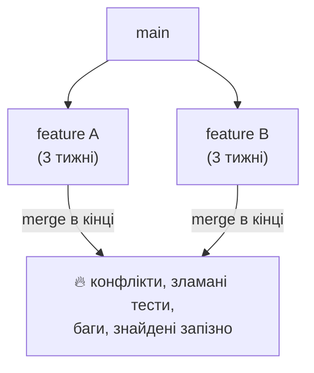
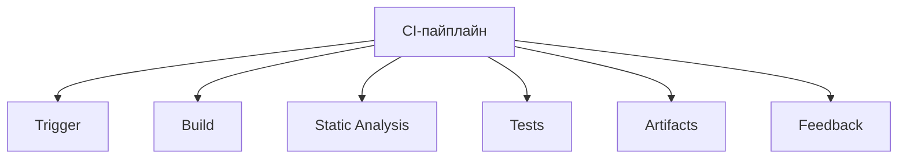
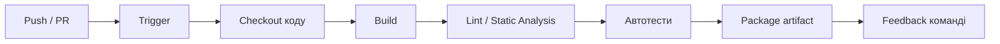
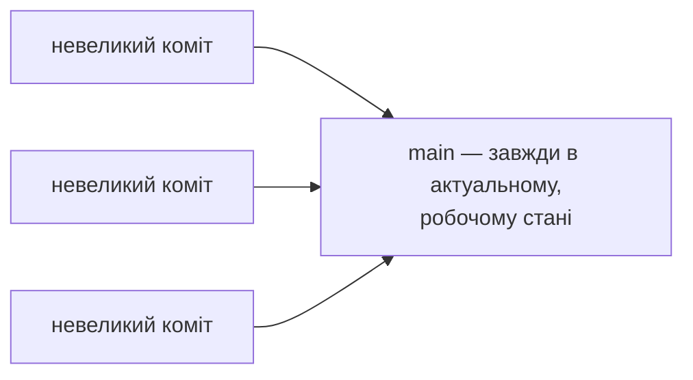
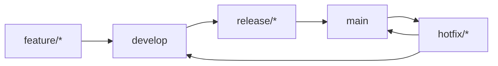
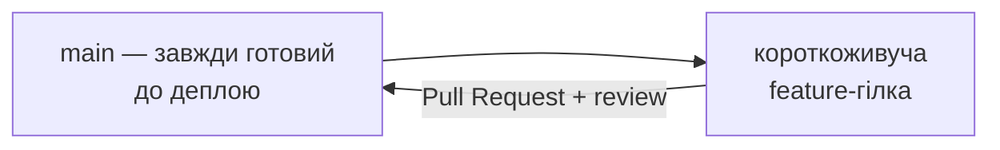
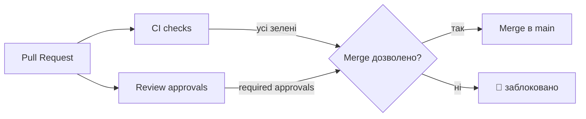
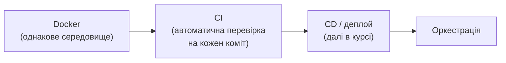

# Continuous Integration: теорія та складові

<small>Технології DevOps</small>

<style>
.reveal h1 { font-size: 1.7em; }
.reveal h2 { font-size: 1.2em; }
.reveal h3 { font-size: 0.95em; }
.reveal p, .reveal li { font-size: 0.62em; line-height: 1.4; }
.reveal blockquote { font-size: 0.7em; }
.reveal table { font-size: 0.58em; }
.reveal small { font-size: 0.5em; }
.reveal pre, .reveal code { font-size: 0.48em; }
.reveal ol, .reveal ul { display: inline-block; text-align: left; }

.reveal .mermaid,
.reveal .mermaid svg {
  width: 100% !important;
  height: auto !important;
  max-width: 1000px;
  max-height: 600px;
}
.reveal .mermaid { display: flex; justify-content: center; }
.reveal .mermaid .nodeLabel,
.reveal .mermaid text,
.reveal .mermaid tspan,
.reveal .mermaid .edgeLabel,
.reveal .mermaid .mindmap-node text {
  fill: #1e293b !important;
  color: #1e293b !important;
}
.reveal .mermaid .node rect,
.reveal .mermaid .node polygon,
.reveal .mermaid .node circle {
  fill: #f4f1ea !important;
  stroke: #1e293b !important;
}

.card-row { display: flex; gap: 1.2rem; justify-content: center; margin-top: 1rem; }
.card { background: #f4f1ea; border-radius: 12px; padding: 0.8rem 1.2rem; font-size: 0.6em; text-align: left; }
.card b { font-size: 1.1em; }

.pyramid { display: flex; flex-direction: column-reverse; gap: 6px; align-items: center; margin-top: 1rem; }
.pyramid .tier { background: #f4f1ea; border: 1px solid #1e293b; border-radius: 8px; padding: 0.5rem 1rem; font-size: 0.55em; text-align: center; }
.pyramid .t1 { width: 80%; }
.pyramid .t2 { width: 55%; }
.pyramid .t3 { width: 30%; background: #e2e8f0; font-weight: bold; }
</style>

Note: Ця лекція — суто теоретична основа CI перед тим, як ми на наступній практиці візьмемось за конкретний інструмент (GitHub Actions / GitLab CI). Мета — щоб студенти розуміли, з яких частин складається пайплайн і навіщо кожна з них, ще до того, як побачать конкретний YAML-синтаксис.

---

## План заняття

1. Що таке CI і яку проблему вирішує
2. З чого складається CI-пайплайн
3. Практики, що роблять CI ефективним
4. Ландшафт інструментів

---

## Нагадаємо: з чого ми прийшли

- Минулого разу розібрали Docker — спосіб зробити середовище **однаковим** скрізь
- Але однакового середовища недостатньо: хтось же має **автоматично** його використати після кожного коміту
- CI-система — це і є та автоматика, що на кожен push бере код, збирає й перевіряє його в такому середовищі
<!-- .element: class="fragment" -->

<small>Саме тому CI-раннери на практиці найчастіше запускають кроки пайплайна всередині Docker-контейнерів — учора й сьогодні напряму пов'язані</small>

---

<!-- .slide: data-background-color="#eef2ff" -->

# Частина 1

## Що таке CI і яку проблему вирішує

---

## До CI: "Integration Hell"



Чим довше гілки живуть окремо — тим болючіший і непередбачуваніший момент їх злиття

--

### Класичний "нічний білд"

До появи CI команди збирали проєкт раз на добу (**nightly build**) і зранку розбирались, що зламалось за день

Проблема: якщо зламали 5 людей одночасно, шукати винного доводиться вручну, а фікс відкладається ще на добу

---

## Що таке Continuous Integration

> Практика, за якої розробники часто (кілька разів на день) зливають зміни в спільну гілку, і кожна зміна автоматично збирається й перевіряється

Note: Термін "Continuous Integration" вперше згадав Ґреді Буч (Grady Booch) ще в 1991 році в контексті свого методу проєктування. Але справжню практичну форму й популярність він здобув у 1999-му як одна з 12 практик Extreme Programming (XP) Кента Бека — там вимагали інтегрувати й тестувати код по кілька разів на день. А головним референсом індустрії досі лишається есе Мартіна Фаулера 2000 року (оновлене у 2006-му) — саме звідти пішла ідея "якщо щось боляче робити — роби це частіше", бо це змушує прибрати біль автоматизацією, а не уникати процесу.

--

### Головний принцип: fail fast

- Чим раніше знайдено помилку — тим дешевше її виправити
- CI перевіряє код одразу після коміту, а не через тиждень на етапі релізу
- Це той самий принцип Andon cord з Toyota, який ми обговорювали — зупинити конвеєр одразу, а не пропустити дефект далі
<!-- .element: class="fragment" -->

---

<!-- .slide: data-background-color="#eef2ff" -->

# Частина 2

## З чого складається CI-пайплайн

---

## Огляд компонентів



---

## Потік виконання пайплайна



--

### Trigger — що запускає пайплайн

- **On push** — на кожен коміт у гілку
- **On pull/merge request** — перед злиттям у main
- **Scheduled** — за розкладом (наприклад, нічні прогони важких тестів)
- **Manual** — вручну, за потреби
<!-- .element: class="fragment" -->

--

### Build — збірка

- Компіляція (Java, C#) або бандлінг (JS-фронтенд)
- Встановлення залежностей
- Якщо цей крок падає — далі пайплайн навіть не йде: немає сенсу тестувати те, що не зібралось
<!-- .element: class="fragment" -->

--

### Static Analysis — перевірка без запуску коду

- **Linting** — стиль коду, потенційні помилки (ESLint, Checkstyle, Pylint)
- **SAST** (Static Application Security Testing) — пошук вразливостей прямо в коді
- Швидше за тести, тому зазвичай запускається раніше в пайплайні
<!-- .element: class="fragment" -->

--

### Tests — автоматизовані тести

<div class="pyramid">
<div class="tier t3">E2E-тести</div>
<div class="tier t2">Інтеграційні тести</div>
<div class="tier t1">Unit-тести</div>
</div>

Чим нижче рівень — тим більше тестів і тим швидше вони виконуються; тому unit-тестів має бути найбільше

--

### Code coverage і quality gate

- **Code coverage** — який відсоток коду реально виконується під час тестів
- **Quality gate** — пайплайн примусово падає, якщо покриття чи якість коду нижче встановленого порогу
- Це перетворює "добре було б писати тести" на обов'язкову умову для злиття коду
<!-- .element: class="fragment" -->

--

### Artifacts — результат збірки

- Скомпільований застосунок, `.jar`, `.zip`, або одразу **Docker-образ**
- Артефакт з CI зазвичай потрапляє в registry (Docker Hub, Nexus, Artifactory)
- Той самий артефакт, що пройшов CI, і розгортається далі — без повторної збірки на проді
<!-- .element: class="fragment" -->

--

### Feedback — зворотний зв'язок команді

- Статус пайплайна прямо в pull request (✅ / ❌)
- Сповіщення в Slack/Email при падінні
- **Build badge** у README — публічний індикатор стану main-гілки
<!-- .element: class="fragment" -->

---

<!-- .slide: data-background-color="#eef2ff" -->

# Частина 3

## Практики, що роблять CI ефективним

---

## Trunk-based development



Короткоживучі гілки (години-день), часті невеликі merge — пряма протилежність "Integration Hell" з початку лекції

--

### А що з великими фічами?

- **Feature flags** — код фічі вже в main, але вимкнений прапорцем, поки не готовий
- Дозволяє інтегрувати рано, навіть якщо фіча ще не завершена для користувачів
- Дає змогу деплоїти часто (як ми говорили про DORA), не чекаючи повної готовності фічі
<!-- .element: class="fragment" -->

---

## Стратегії гілкування: чому це важливо для CI

Trunk-based development — це один із варіантів, а не єдиний. Гілкова модель команди напряму визначає, наскільки болючою чи безболісною буде інтеграція

--

### GitFlow



П'ять типів гілок: `feature`, `develop`, `release`, `main`, `hotfix` — довгоживучі `develop` і `main` існують паралельно

--

### Проблема GitFlow для CI

- Гілка `feature/*` живе довго, доки не піде в `develop` — це знову ризик "Integration Hell"
- Складна модель добре підходила для рідкісних, версійованих релізів (десктопний софт раз на квартал)
- Для команд, що деплоять по кілька разів на день, забагато довгоживучих гілок і зайвих кроків
<!-- .element: class="fragment" -->

Note: Автор GitFlow, Вінсент Дріссен, ще в 2010 році описав цю модель для проєкту з чітким релізним циклом. Через роки, коли індустрія масово перейшла на безперервний деплой, він сам додав до оригінального поста примітку: GitFlow не завжди гарний вибір для сучасних вебзастосунків із частими релізами, і для команд, що практикують continuous delivery, варто розглянути простіші моделі на кшталт GitHub Flow.

--

### GitHub Flow



Лише `main` і короткі feature-гілки через PR — по суті trunk-based development, формалізований через обов'язковий рев'ю

--

### GitLab Flow

- Додає **environment-гілки**: `main` → `staging` → `production`
- Або **release-гілки** для версійованого софту, якщо потрібно підтримувати кілька версій одночасно
- Компроміс між простотою GitHub Flow і потребою явно бачити, що саме зараз де задеплоєно
<!-- .element: class="fragment" -->

--

### Що обрати

| Модель | Складність | Найкраще підходить |
|---|---|---|
| GitFlow | Висока | Рідкісні версійовані релізи |
| GitHub Flow | Низька | Часті деплої, один продакшн |
| GitLab Flow | Середня | Потрібні явні стадії (staging/prod) |
| Trunk-based | Низька | Максимальна частота інтеграції, DORA elite-показники |

---

## Строгий GitHub Flow: налаштування репозиторію

Культура каже "не пуште напряму в main". Але на дисципліну покладатись не варто — те саме "Automation" з CAMS: правило варто **технічно унеможливити**, а не просити дотримуватись

--

### Branch protection rule для main

`Settings → Branches → Branch protection rule`

- **Require a pull request before merging** — прямий push у `main` стає неможливим
- **Require approvals** — мінімум N рецензентів мають схвалити PR
- **Dismiss stale approvals** — нові коміти в PR скидають старі схвалення
<!-- .element: class="fragment" -->

--

### PR-гейт і CI разом



**Require status checks to pass before merging** — саме тут GitHub підв'язує конкретні CI-джоби (вони з'являються у списку після першого запуску пайплайна)

--

### Ще кілька важливих прапорців

- **Require branches to be up to date before merging** — PR має включати останній main, інакше може зламатись те, чого автор не бачив
- **Require conversation resolution before merging** — не можна змерджити, поки не закриті всі коментарі рев'ю
- **Do not allow bypassing the above settings** — правила діють навіть для адмінів репозиторію, інакше вони не мають сенсу
<!-- .element: class="fragment" -->

--

### CODEOWNERS

```text
# CODEOWNERS
/backend/    @team-backend
/frontend/   @team-frontend
*.yml        @devops-lead
```

**Require review from Code Owners** автоматично призначає потрібних рецензентів залежно від того, які файли зачепив PR — не треба пам'ятати вручну, кого звати

--

### Стратегія злиття PR

| Стратегія | Історія `main` | Коли використовувати |
|---|---|---|
| Merge commit | Видно всю гілку цілком | Рідко — коли важлива повна історія |
| Squash and merge | Один коміт на весь PR | За замовчуванням для GitHub Flow |
| Rebase and merge | Лінійна, без merge-вузла | Команди, що люблять чисту лінійну історію |

**Require linear history** забороняє звичайні merge-коміти — лишає тільки squash або rebase

--

### Дрібниці, які теж важливі

- **Automatically delete head branches** — короткоживуча гілка сама зникає після merge, не смітить у репозиторії
- **Block force pushes** і **restrict deletions** для `main` — ніхто не перепише історію силою
- **Rulesets** (новіша функція GitHub) — ті самі правила, але на рівні всієї організації, а не одного репозиторію
<!-- .element: class="fragment" -->

---

## "Тримати білд зеленим"

- Якщо пайплайн на main почервонів — це пріоритет №1 для команди, не "коли-небудь потім"
- Культурна норма, а не технічна вимога — це пряме продовження **Culture** з CAMS
- Команда, що звикла ігнорувати червоний білд, дуже швидко перестає йому довіряти взагалі
<!-- .element: class="fragment" -->

---

<!-- .slide: data-background-color="#eef2ff" -->

# Частина 4

## Ландшафт інструментів

---

## Self-hosted vs SaaS

| | Self-hosted (Jenkins) | SaaS (GitHub Actions, GitLab CI) |
|---|---|---|
| Де працює | Власний сервер | Інфраструктура провайдера |
| Налаштування | Гнучке, багато плагінів | Простіше, вбудоване в репозиторій |
| Обслуговування | На вас | На провайдері |

Note: Jenkins спершу називався **Hudson** і його створив Кошуке Кавагучі (Kohsuke Kawaguchi), працюючи в Sun Microsystems, у 2004–2005 роках. Коли Oracle придбала Sun і виникла суперечка навколо контролю над проєктом і торговою маркою, спільнота у 2011 році форкнула проєкт під новою назвою — Jenkins. Сьогодні це один із найпоширеніших CI-серверів саме завдяки величезній екосистемі плагінів, яку роками нарощувала спільнота.

---

## Pipeline as Code

- Конфігурація пайплайна — це файл у самому репозиторії (`Jenkinsfile`, `.gitlab-ci.yml`, `.github/workflows/*.yml`)
- Версіюється разом із кодом, проходить code review так само, як і сам застосунок
- Немає "налаштувань, які пам'ятає тільки один адмін" — усе видно в git-історії
<!-- .element: class="fragment" -->

<small>Синтаксис конкретних інструментів (GitHub Actions / GitLab CI) — тема наступної практичної лекції</small>

---

## CI в хмарній екосистемі

Пригадаємо карту CNCF з першої лекції — CI/CD там займала окрему категорію

**Tekton**, **Argo Workflows** — CNCF-проєкти для запуску пайплайнів прямо всередині Kubernetes, де кожен крок пайплайна виконується в окремому Pod

---

## Що ми сьогодні зв'язали



---

## Питання для закріплення

1. Чому довгоживучі feature-гілки збільшують ризик "Integration Hell"?
2. Навіщо static analysis запускають раніше за автотести в пайплайні?
3. Чому unit-тестів у тестовій піраміді має бути найбільше?
4. Що таке feature flag і як він дозволяє поєднати trunk-based development з великими фічами?
5. Чому сам автор GitFlow пізніше порадив частині команд відмовитись від його моделі?
6. Чому "Do not allow bypassing" для адмінів репозиторію — важливий пункт, а не формальність?
7. Чим Pipeline as Code краще за ручне налаштування CI через UI?

---

# Дякую за увагу

### Наступна тема: GitHub Actions / GitLab CI на практиці
